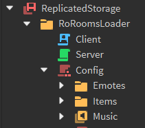
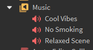

# Easy Loader

Easily load and configure RoRooms without ever touching a line of code! Instead, use Roblox instances and attributes.

# Items 🔧

Items are `Tool` objects, and go under `Config.Items`.

| Attribute          | Type     | Optional |
| ------------------ | -------- | -------- |
| `ItemId`           | `string` | ❌        |
| `Tool`             | `Tool`   | ❌        |
| `DisplayName`      | `string` | ✅        |
| `LevelRequirement` | `number` | ✅        |
| `Category`         | `string` | ✅        |
| `Color`            | `Color3` | ✅        |
| `LabelText`        | `string` | ✅        |
| `LabelIcon`        | `string` | ✅        |

# Emotes 💃

Emotes are `Animation` objects, and go under `Config.Emotes`.

| Attribute          | Type        | Optional |
| ------------------ | ----------- | -------- |
| `ItemId`           | `string`    | ❌        |
| `Animation`        | `Animation` | ❌        |
| `Emoji`            | `string`    | ✅        |
| `DisplayName`      | `string`    | ✅        |
| `LevelRequirement` | `number`    | ✅        |
| `Category`         | `string`    | ✅        |
| `Color`            | `Color3`    | ✅        |
| `LabelText`        | `string`    | ✅        |
| `LabelIcon`        | `string`    | ✅        |

# Music 🎶

Simply drop `Sound` instances into your `Config.Music` folder!

