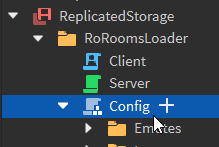
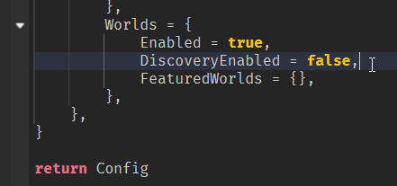

# Easy Loader

Easily load and configure RoRooms without ever touching a line of code! Instead, use Roblox instances and attributes.

## Items 🔧

Items are `Tool` objects, and go under `Config.Items`.

| Attribute             | Type     | Optional |
| --------------------- | -------- | -------- |
| `ItemId`              | `string` | ❌        |
| `Tool`                | `Tool`   | ❌        |
| `DisplayName`         | `string` | ✅        |
| `LevelRequirement`    | `number` | ✅        |
| `GamepassRequirement` | `number` | ✅        |
| `Category`            | `string` | ✅        |
| `Color`               | `Color3` | ✅        |
| `LabelText`           | `string` | ✅        |
| `LabelIcon`           | `string` | ✅        |

## Emotes 💃

Emotes are `Animation` objects, and go under `Config.Emotes`.

| Attribute             | Type      | Optional |
| --------------------- | --------- | -------- |
| `ItemId`              | `string`  | ❌        |
| `Emoji`               | `string`  | ✅        |
| `AllowMovement`       | `boolean` | ✅        |
| `DisplayName`         | `string`  | ✅        |
| `LevelRequirement`    | `number`  | ✅        |
| `GamepassRequirement` | `number`  | ✅        |
| `Category`            | `string`  | ✅        |
| `Color`               | `Color3`  | ✅        |
| `LabelText`           | `string`  | ✅        |
| `LabelIcon`           | `string`  | ✅        |

## Roles 🔳

Roles are `Configuration` objects, and go under `Config.Roles`.

| Attribute             | Type     | Optional |
| --------------------- | -------- | -------- |
| `RoleId`              | `string` | ❌        |
| `Name`                | `string` | ❌        |
| `Color`               | `Color3` | ✅        |
| `LayoutOrder`         | `number` | ✅        |
| `LevelRequirement`    | `number` | ✅        |
| `GamepassRequirement` | `number` | ✅        |

## Physical 🌍

### Locked Zones ⭕🔒

Locked zones are parts that prevent players from being within them based on certain criteria. To create one, apply the `RR_LockedZone` tag.

| Attribute             | Type     | Optional |
| --------------------- | -------- | -------- |
| `LevelRequirement`    | `number` | ✅        |
| `GamepassRequirement` | `number` | ✅        |

### Locked Doors 🚪🔒

Locked doors are parts that prevent players from walking through them based on certain criteria. To create one, apply the `RR_LockedZone` tag.

| Attribute             | Type     | Optional |
| --------------------- | -------- | -------- |
| `LevelRequirement`    | `number` | ✅        |
| `GamepassRequirement` | `number` | ✅        |

## Music 🎶

Simply drop `Sound` instances into your `Config.Music` folder!

## Worlds 🌐

### Disabling discovery

You may not want to participate in RoRooms' worlds network, and that choice is supported. Understand that by doing this, your world will not receive support from any other worlds.

1. Open the Config module

2. Type this in:

3. Additionally, you can set `Enabled = false` to disable the worlds menu entirely. Otherwise, you can still promote your own worlds by pasting their PlaceIds into `FeaturedWorlds`.